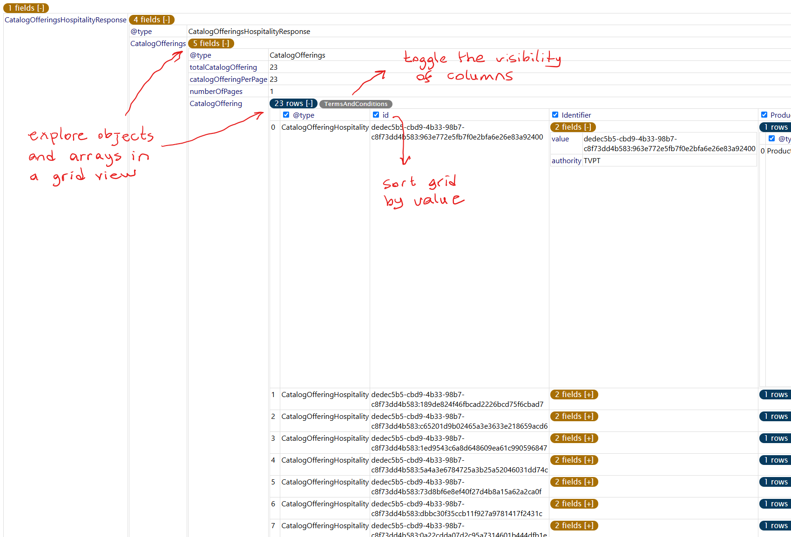

# Database Explorer

Effortlessly explore, visualize, understand, and interact with your databases directly within Visual Studio Code.

## Features

- **Database Discovery and Navigation:** One-click access to your tables, fields, data, histograms, and more.
- **Database Metadata:** Your tables and fields displayed with color codes, easy to see and understand.
- **Descriptions:** Add descriptions to your tables and fields while discovering your data models.
- **Aggregations:** One-click group by, sort, min-max, counts.
- **Navigation:** Jump from one table to another by following hard or soft foreign keys
- **Code Generation:** Generate code with your OPENAI_API_KEY in your environment variables 

---

> Tip: View -> Command Palette (Shift-Ctrl-P) and find the command "Database Explorer: Start"
